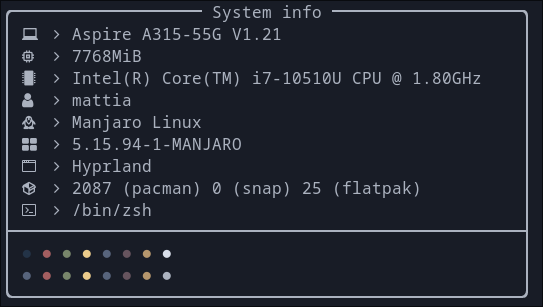

# cfetch
**Simple fetch tool for Linux written in C++**




The program is _extremely_ experimental and bugs are to be expected. Feel free to
report any issue and I'll try to fix it if it's within my abilities.  
The program doesn't have a config file (for now).  

The general concept and the structure of the code base was highly inspired by
[sysfex](https://github.com/mehedirm6244/sysfex). 

## Installation
Make sure to have these dependences installed:
- `xrandr`
- `Material Design Icons Desktop`

Then run the following commands:

``` sh
git clone https://github.com/MattiaSilvestri/cfetch
cd cfetch/build
cmake ..
make
```

The binary file is automatically generated int the `bin` folder, you can move it
in your `PATH` to run it as a regular command.

## TODO
- [ ] Add config file
- [ ] Add more colours
- [ ] Add host name


