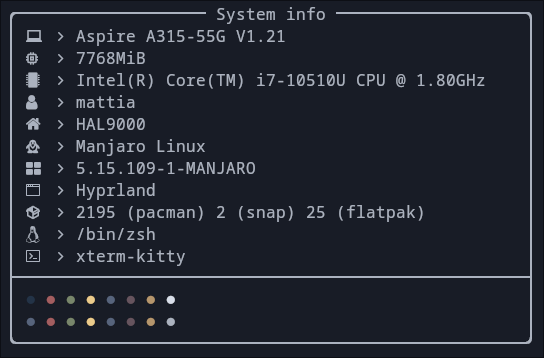

# cfetch
**Simple fetch tool for Linux written in C++**




The program is _extremely_ experimental and bugs are to be expected. Feel free to
report any issue and I'll try to fix it if it's within my abilities.  
The program doesn't have a config file (for now).  

The general concept and the structure of the code base was highly inspired by
[sysfex](https://github.com/mehedirm6244/sysfex). 

## Installation
Make sure to have these dependences installed:
- `Material Design Icons Desktop` (you can download the .ttf file from [here](https://github.com/Templarian/MaterialDesign-Font))
- `cmake`
- `make`

Then make the `setup.sh` file executable and run it:

``` sh
chmod +x setup.sh
./setup.sh
```

The program requires a compiler that supports C++17 or higher to work properly.
If you're using GCC, C++17 features are supported from GCC 5. To check the
version you are currently using, run:

``` sh
g++ --version
```


## TODO
- [x] Add installation script
- [ ] Add more colours
- [ ] Add host name
- [ ] Add asciiart
- [ ] Add terminal name
- [ ] Add config file


